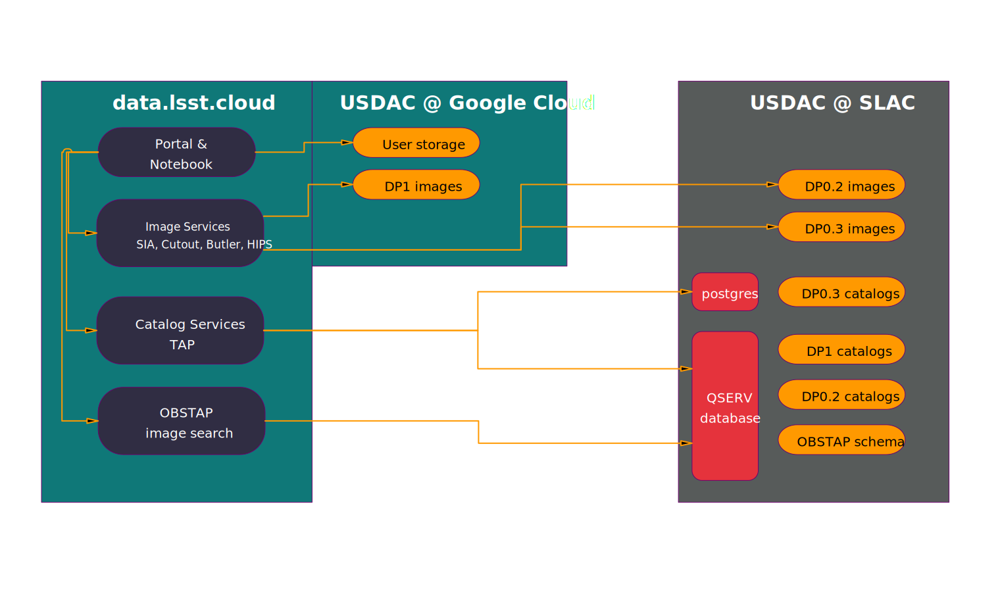

# Hybrid model

The flagship Rubin Science Platform (RSP) at [data.lsst.cloud](https://data.lsst.cloud) is a hybrid deployment, with services and data distributed across multiple data centers:

- Most of the services and some data are hosted on the Google Cloud Platform.
- A few services and most of the data are hosted at our US Data Facility (USDF) at SLAC.

Together, these make up the US Data Access Center.



This architecture provides flexibility and performance while controlling storage costs.
However, it can make understanding the system's behavior during outages challenging.
Read on to understand what to expect when USDF/SLAC is offline and how to continue using the RSP during such outages.

## Outages

When an outage occurs, service and data availability can be affected differently depending on which data access center is impacted.

### Service availability during a USDF (SLAC) outage

The following table shows service availability when [data.lsst.cloud](https://data.lsst.cloud) is operational but USDF/SLAC is experiencing an outage:

| Service         | DP1 | DP0.3 | DP0.2 |
| --------------- | --- | ----- | ----- |
| TAP (catalogs)  | ❌  | ❌    | ❌    |
| HIPS            | ✅  | ❌    | ❌    |
| SIA (images)    | ✅  | N/A   | ❌    |
| SODA (cutouts)  | ✅  | ❌    | ❌    |
| Butler (images) | ✅  | N/A   | ❌    |
| ObsTAP (images) | ❌  | N/A   | ❌    |

### What you can do during a USDF/SLAC outage

- Access the Notebook aspect
- Use services marked with ✅ above
- Analyze previously retrieved data
- Access services from external archives

### Portal functionality during a USDF/SLAC outage

The following image shows which Portal tabs remain functional during a USDF/SLAC outage:


```{tip}
If your portal does not look like the above image, you can configure the visible tabs by using the "hamburger" menu on the top left.
```

### Getting updates during a USDF/SLAC outage

During LSST Data Previews, the errors from RSP services may not always make it obvious what the issue is, so do monitor updates posted in banners on the [data.lsst.cloud homepage](https://data.lsst.cloud).
See {doc}`/guides/life/updates` for other ways to stay informed.
