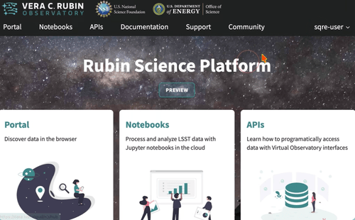

#################
Quotas and limits
#################

As an approved user of the |rsp-at| you have access to certain individual, group, and shared resources.
These resources are constrained by:

* the cost of providing the Platform
* the current capability of the Platform to scale
* fairness considerations (to ensure the activity of some users does not disadvantage other users)

This page documents how to understand the RSP limits currently in place.
For information on other available resources beyond the RSP, including additional resources allocated via the Resource Allocation Committee (RAC) see `this link <https://rubinobservatory.org/for-scientists/resources/add-compute>`__.

.. important::
   The Rubin Science Platform is currently in preview mode, and its capabilities are expected to evolve for the duration of the Survey. The nature and amount of these resources are also expected to evolve (mostly upwards) for the duration of the survey.

   During times of peak demand, some of these limits may be lowered temporarily to maintain availability. Always consult your |rsp-quotas-page| (found under your account settings or directly at |rsp-quotas-url| ) for limits being currently applied — that page is a live view of the system.

If you are a heavy user of the RSP APIs, make sure to read the relevant section below.

The Quotas page
===============

You can find your |rsp-quotas-page| under your user profile, accessible through the :rsp-link:`rsp` home page:

You can consult the Quotas page for what limits are being placed on your activity on |rsp-env-link| at any given time.
This is true whether the limits applied are system-wide, or specific to your individual account, or to a group that you belong to.

Below is a list of individual sections of the Quotas page and an explanation of what the values listed mean.

Portal
------

No Portal-specific quotas exist. However, the Portal does API requests on your behalf, and these count towards your usage the same as they would if you were invoking an API directly, or via the Notebooks.

For example, if you have exhausted your catalogue query rate limit with an external pyvo program you have written, the Portal will not be able to perform further queries until your allowance has reset.

Notebooks
---------

When you access the Notebooks capability, your JupyterLab session is allocated its own container in which anything you do (run notebooks, run code from the JupyterLab terminal) executes.
Your |rsp-quotas-page| shows the memory size and number of cores for the largest instance of container you can ask the Notebook service for.

.. important::
   Exhausting your allocated memory can cause your container to die.
   If this happens, start a new session and change your code to avoid memory-hungry operations.

Any calls you make to our APIs inside the Notebook service count towards your API quota.

APIs
----

.. note::
   At the current time, the service names shown in your |rsp-quotas-page| page are our internal engineering names for the various services.
   This will be fixed soon.

This section describes current types of API limits.
More nuanced API controls are likely to be available in the future that go beyond those described here.

Rate limits
~~~~~~~~~~~

Most APIs are rate-limited with a cap on requests over a 1-minute period.
These are listed under the "Rate limits" sub-section.
Your |rsp-quotas-page| shows you how many requests you can make in 60 seconds before a given service starts refusing your requests.
Once that happens, 60 seconds have to pass before the counter resets.

Concurrent queries
~~~~~~~~~~~~~~~~~~

Catalog queries also have a concurrency limit (listed under "Concurrent queries").
These limit the number of concurrent queries in flight.
For example if Qserv-hosted catalog queries have a concurrency limit of 10, and you have 10 queries actively being serviced, you cannot submit an 11th one; one has to finish first.

Understanding usage patterns
----------------------------

Rubin Data Services engineers monitor RSP usage to find a balance between servicing as many needs as possible without exhausting our resources.
We may contact you if we do not understand your usage pattern so that we can inform future improvements in this area.
If that happens, it does not mean you have done something wrong — just something that we think we can learn from.
