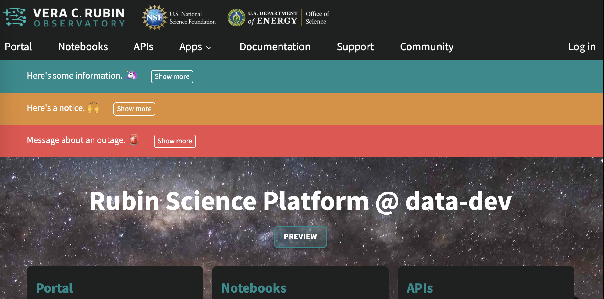

##################
Staying up to date
##################

As an RSP user, you will want (need, even) to stay informed on new features and service availability.
Here is how to do that:

Banners
=======

Your RSP's landing page at |rsp-env-link| features banners highlighting timely information.

These are color coded depending on severity.

* Green: New features, new data, and other good news
* Orange: Heads up about minor service issues (including :doc:`patch-thursday`) or important service information
* Red: Typically reserved for major and/or unplanned service outages

In the event where there is an on-going incident, please refrain from reporting bugs that seem related.
Incident banners are removed when we judge the incident resolved.

   Banners on the RSP landing page

You can click on the "more" link to see a more verbose message and/or a link to more information.

Data Services news
==================

Lengthier content is posted in the `News → Data Services category of the Community Forum <https://community.lsst.org/c/news/data-services/64>`__

Here is the RSS feed for that topic: `<https://community.lsst.org/c/news/data-services/64.rss>`__
