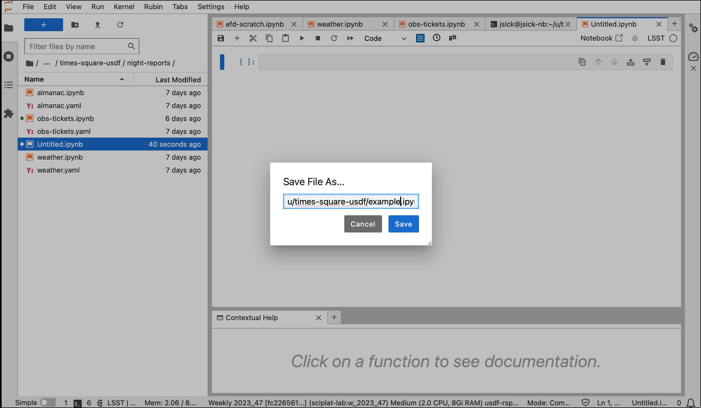
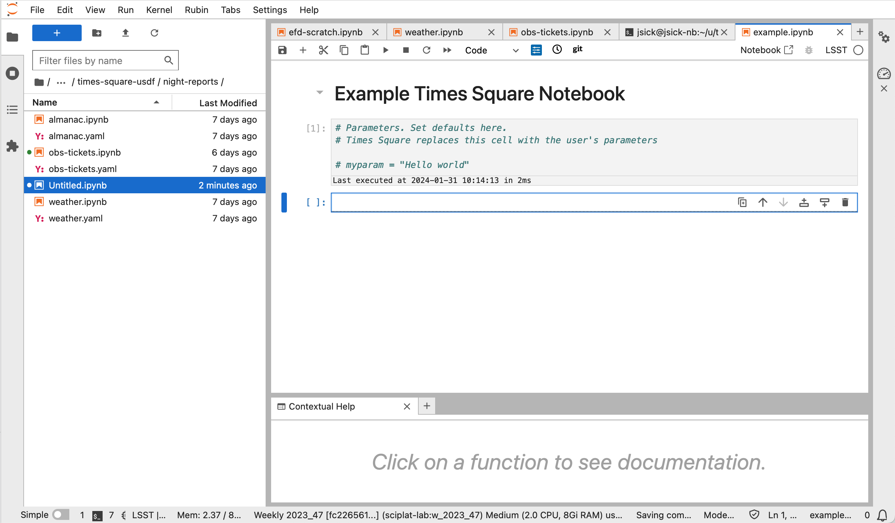
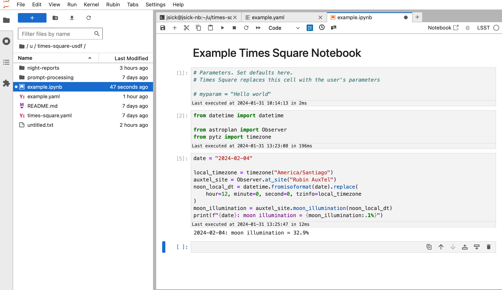
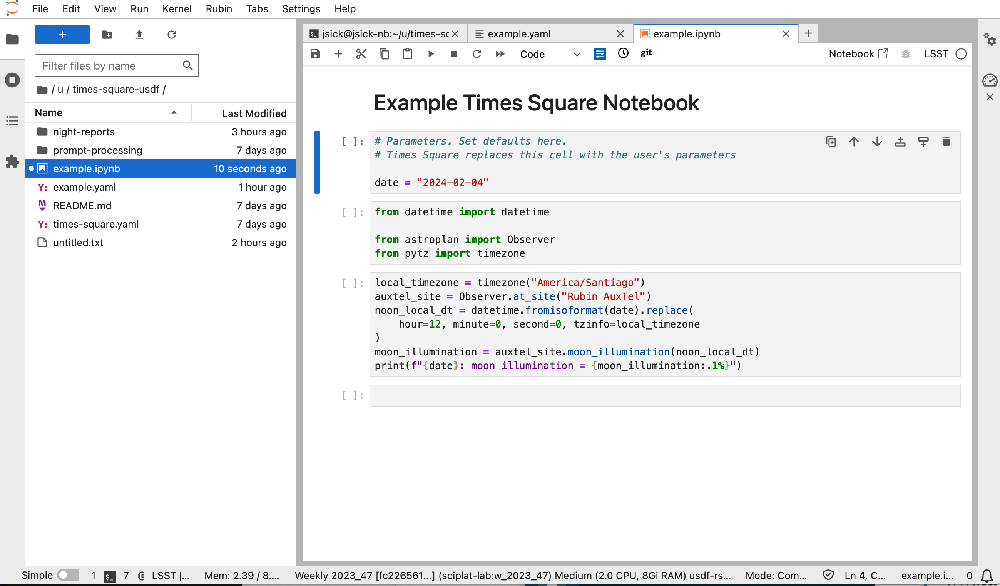
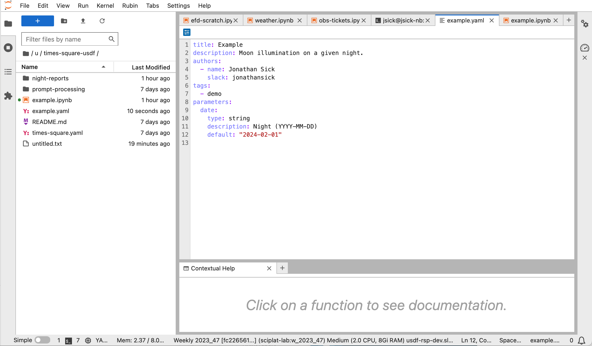
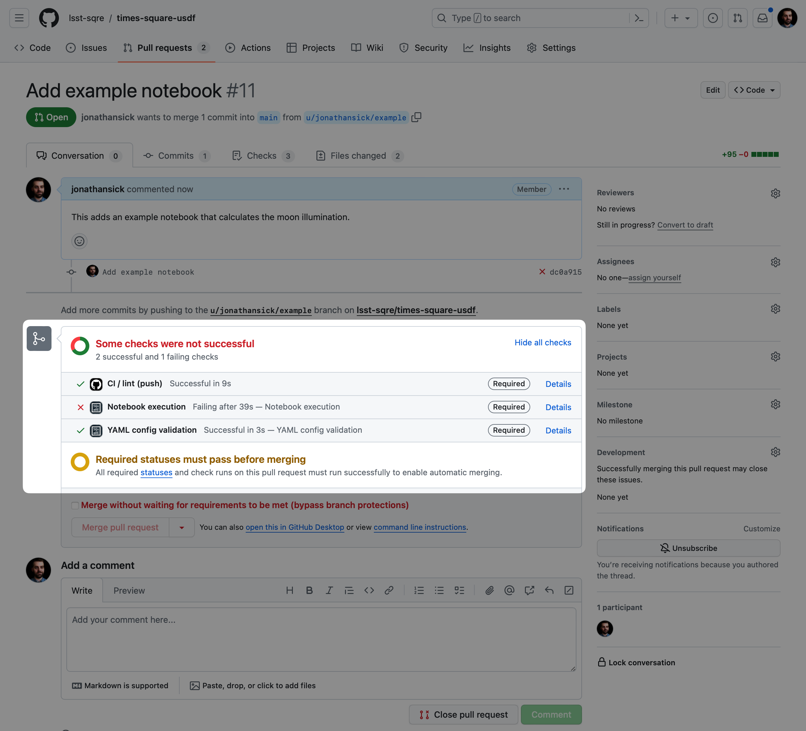
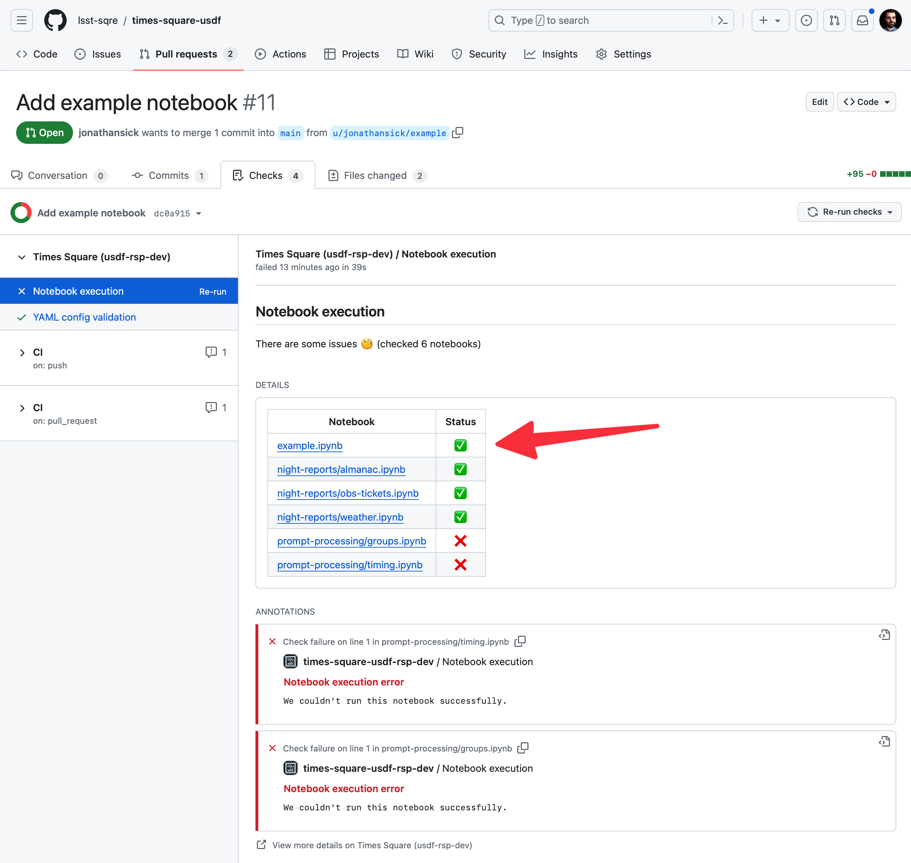
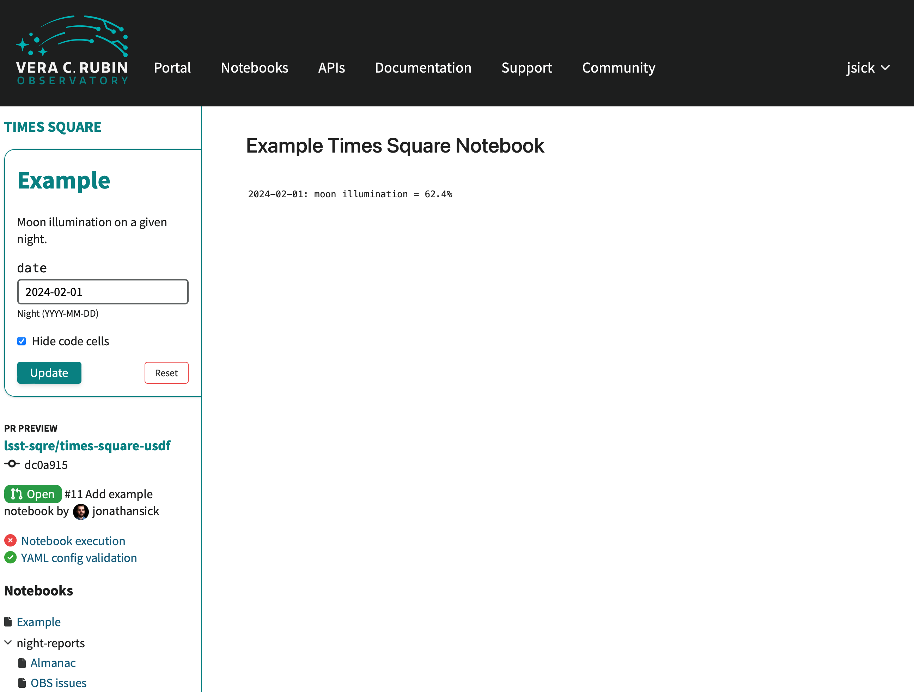

###############################################
Overview of writing a notebook for Times Square
###############################################

If you know how to create a Jupyter notebook, publishing a notebook to Times Square will be familiar.
This page outlines the basic steps for adding and authoring a notebook for Times Square, and links to further documentation.

1. Setting up on the Science Platform Notebook Aspect
=====================================================

Although its not strictly necessary, the best place to create and edit notebooks for Times Square is from the Rubin Science Platform's Notebook Aspect.
If the notebook runs from your interactive session, it will run on Times Square (provided it doesn't use user-specific software or data, see :ref:`ts-reqs-user-home-referencing`).

First :doc:`start a JupyterLab session on the Notebook Aspect <../notebooks/starting-and-stopping/start-a-notebook-session>`.
Then from a JupyterLab terminal, clone a GitHub repository that's already installed on Times Square:

.. code-block:: bash

   git clone https://github.com/lsst-sqre/times-square-usdf
   cd times-square-usdf

Make sure you've set up GitHub access in your JupyterLab environment (see :doc:`../notebooks/configuration/git-configuration`).
You'll "publish" your notebook to Times Square by pushing it to GitHub.

2. Creating a new notebook
==========================

Create a new notebook and save it into the repository you cloned above:

1. From the JupyterLab Launcher, create a new notebook with the "LSST" kernel.

2. Save the notebook into the repository you cloned above. Select :menuselection:`File --> Save Notebook As...` and set the notebook's path and name.

Make sure the path is within the repository.
You can also save the notebook into a subdirectory of the repository.
The directory hierarchy is reflected in the Times Square interface, so it's a useful tool for organizing notebooks.

   The "Save Notebook As..." dialog box. The path is set to the repository cloned above.

3. Scaffold the notebook cells
==============================

Times Square uses the :ref:`first code cell in the notebook for setting parameters <ts-reqs-parameters-cell>`.
It's useful to mark this cell with a comment so that you don't forget about its special role.

   The beginnings of a notebook for Times Square. The first code cell, labeled ``[1]`` has a Python commend to remind authors that this cell is used by Times Square for setting parameters.
   You can add Markdown prose cells before the parameters cell. This notebook has a Markdown cell with the notebook's title.

4. Develop the notebook's content
=================================

Now you can develop the notebook's content as you would normally.
Remember that in Times Square notebooks, the user will focus on the cell outputs, and by default the code cells are hidden.

   A notebook that computes the moon's illumination on a given date using Astroplan_. At this stage the notebook is functional, but it isn't parameterized yet.

5. Parameterize the notebook
============================

*Parameters* allow the user to set values that a notebook uses in its computations.
In the example notebook, a user should be able to set the date when the moon illumination is computed.

The general process for parameterizing a notebook is:

1. Add a variable to the parameters cell and assign a default value. The value of this variable is always a Python string even if you intend to treat it as a specific Python type (see :doc:`parameter-types`).
2. Edit the notebook to use that parameter variable (or *variables*). In your code you might need to convert the parameter value to a Python type. See :doc:`parameter-types` for examples.

   The completed notebook. The parameters cell has a ``date`` variable so that Times Square users can set the date when they view the notebook in the browser.

6. Create a metadata sidecar file
=================================

The metadata sidecar is a YAML file that contains metadata about the notebook for Times Square.
It's always has the same path and name as the notebook, but with a ``.yaml`` extension.
This file always goes alongside its notebook, hence the term "sidecar."

1. In the JupyterLab Launcher, create a new text file. Select :menuselection:`File --> Save Text file as...` to save the file with the same path and name as the notebook, but with a ``.yaml`` extension.

   Alternatively you can edit the file with a terminal app like ``vim`` or ``emacs``.

   .. prompt:: bash

      vim example.yaml

2. Populate the file with information about the title and parameters:

   .. code-block:: yaml

      title: Example
      description: Moon illumination on a given night.
      authors:
        - name: Jonathan Sick
          slack: jonathansick
      parameters:
        date:
          type: string
          description: Night (YYYY-MM-DD)
          default: "2024-02-01"

3. Save the file.

   The metadata sidecar file for the example notebook in the JupyterLab file editor.

7. Commit and push the notebook to GitHub
=========================================

Open a JupyterLab terminal and navigate to the repository:

1. Create a branch, if you haven't already:

   .. prompt:: bash

      git switch -c tickets/EXAMPLE

2. Stage and commit both the notebook and metadata sidecar files:

   .. prompt:: bash

      git add example.ipynb example.yaml
      git commit -m "Add example notebook"

3. Push the branch to GitHub:

   .. prompt:: bash

      git push -u origin tickets/EXAMPLE

8. Create a pull request
========================

Create a Pull Request on GitHub that proposes to merge your branch into main.
See the `GitHub Pull Request documentation <https://docs.github.com/en/pull-requests/collaborating-with-pull-requests>`_ for more information.

9. Review the notebook on Times Square
======================================

While your pull request is opened, Times Square will run the notebooks and check the formatting of the sidecar metadata files.

You can view the notebook on Times Square by click on the "Notebook execution" check towards the button of the pull request page and then click on the notebook's name from the check run status.

   A GitHub pull request in a Times Square repo. The highlighted status checks area contains important information, such as whether the YAML sidecar files are valid (``YAML config validation``) and whether the notebooks in the repo ran successfully (``Notebook execution``). Click on a check to see more details.

   The details page for the "Notebook execution" status check. Click on the notebook's name (highlighted with an arrow) to view it on Times Square.

   Previews of notebooks in the pull request. These pages are fully operable so you can test different parameterizations. You can get back to the GitHub pull request by clicking on its title in the left sidebar.

10. Merge the pull request
==========================

While your pull request is open, you can continue to make changes to the notebook and its metadata sidecar file.
Whenever you push an update, Times Square will re-check and re-run the notebook.
Therefore you can keep trying your notebook on Times Square until you're satisfied with the results.

When you're ready to merge the pull request, click the "Merge pull request" button on the pull request page.
At this point, the notebook will be available from the Times Square homepage.
