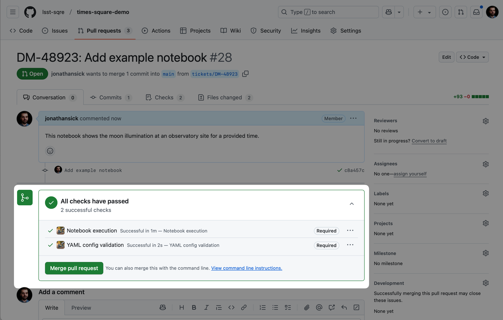

#################################################################
How to add GitHub branch protections to a Times Square repository
#################################################################

On every pull request, Times Square runs GitHub Checks that validate the YAML configuration files and that executes the notebooks to validate that they run without errors.
You should protect the default branch (typically ``main``) to ensure that these checks pass before allowing a pull request to be merged.
To perform this configuration, you need to be an administrator of the GitHub repository.

   Example status checks on a pull request. The "Notebook execution" and "YAML config validation" checks are performed by Times Square.

Adding branch protections
=========================

1. Go to the repository settings by clicking on the :guilabel:`Settings` tab from a repository's GitHub homepage.

2. Click on the :guilabel:`Branches` tab in the left-hand menu.

3. Click on the :guilabel:`Add rule` button.

4. Set the rules:

   - :guilabel:`Branch name pattern`: ``main`` (or the name of your default branch)

   - Enable the following rules:

     - :guilabel:`Require a pull request before merging`
     - :guilabel:`Require status checks to pass before merging`
     - :guilabel:`Require branches to be up to date before merging`

   - Enable the following status checks (*these checks only autocomplete after they have been run at least once*):

     - :guilabel:`YAML config validation`
     - :guilabel:`Notebook execution`

   You can also enable or configure other rules as needed.
   For example, if you have a GitHub Actions workflow that runs pre-commit checks, you can add it to the list of required status checks (see :doc:`pre-commit-howto`).

5. Click on the :guilabel:`Create` button.

   Example branch protection settings for a repository following the guidelines described above.
